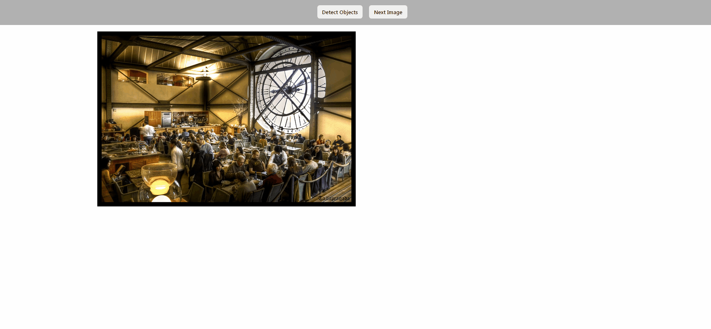

# node-opencv-yolo
YOLO Object detection with OpenCV and Node.js

## Overview
A simple proof-of-concept for using OpenCV to detect objects in images using Python and Node.js

Here's a demo of the project in action.


## Why
My goal for this project was to create a simple proof-of-concept and to explore object detection using OpenCV.

In the future, I hope to use what I've learned here to process live video streams from IP cameras.

## Installation & Usage

In order to use this project you'll need to have the following dependencies installed.
- Python 3.7(Your version of python must be accessible from your environment variables)
- opencv-python
- numpy
- yolov3.weights file

[**Here's a link to download the yolov3 pretrained model weights**](https://pjreddie.com/media/files/yolov3.weights)

Run the following to install the NPM packages:
```
npm install
```

Once you've installed the required dependencies, add some JPEG images to the 'original_images' directory within the project.

Run the following command to start the project:
```
npm start
```
